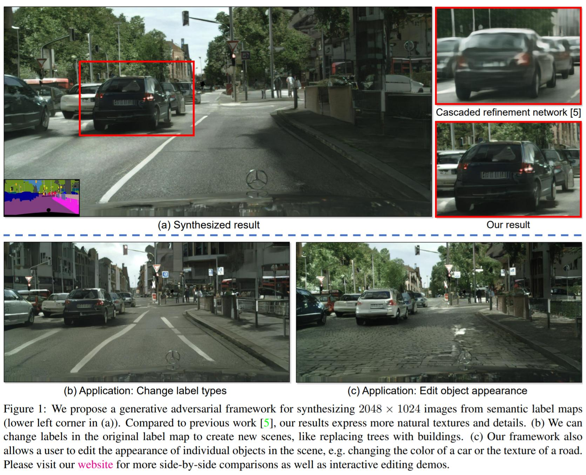
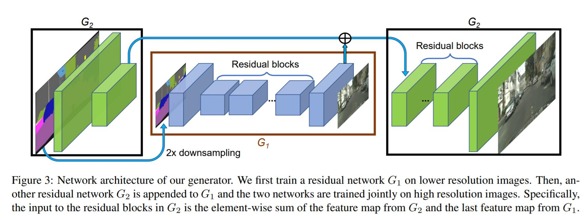
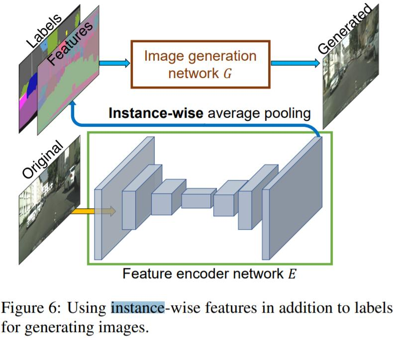

# Contents

- [Pix2PixHD Description](#Pix2PixHD-description)
- [Model Architecture](#model-architecture)
- [Dataset](#dataset)
- [Environment Requirements](#environment-requirements)
- [Script Description](#script-description)
    - [Script and Sample Code](#script-and-sample-code)
    - [Script Parameters](#script-parameters)
    - [Training](#training-process)
        - [Training using labels only](#training-using-labels-only)
            - [Training at 1024x512 resolution](#training_at_1024x512_resolution)
            - [Training at 2048x1024 resolution](#training_at_2048x1024_resolution)
        - [Training adding instances and encoded features](#training_adding_instances_and_encoded_features)
            - [Training at 1024x512 resolution](#training_at_1024x512_resolution)
            - [Training at 2048x1024 resolution](#training_at_2048x1024_resolution)
    - [Evaluation](#evaluation-process)
    - [Prediction Process](#prediction-process)
- [Model Description](#model-description)
    - [Performance](#performance)  
        - [Training Performance](#training-performance)
        - [Evaluation Performance](#evaluation-performance)
- [ModelZoo Homepage](#modelzoo-homepage)

# [Pix2PixHD Description](#contents)

pix2pixHD is an important upgrade of pix2pix, which can realize high-resolution image generation and semantic editing of pictures. The generator and discriminator of pix2pixHD are multi-scale, and the loss function is composed of GAN loss, feature matching loss and content loss.

[Paper](https://arxiv.org/abs/1711.11585): Ting-Chun Wang, Ming-Yu Liu, Jun-Yan Zhu, Andrew Tao, Jan Kautz, Bryan Catanzaro. "High-Resolution Image Synthesis and Semantic Manipulation with Conditional GANs", in CVPR 2017.



# [Model Architecture](#contents)

The pix2pixHD contains a generation network and a discriminant and an encoder networks.
The generator part includes G1 and G2, which are similar in structure. G1 represents the global generator network, and the input and output sizes are 1024×512, G2 indicates local enhancer network, with input and output sizes of 2048×1024.
The discriminator part includes multiple discriminators with the same structure, but their input and output sizes are different, which enhances the discriminator's discrimination ability under different input picture sizes.
The encoder is mainly to support the semantic editing function of pictures, and enable the network to generate real and diverse pictures according to the same semantic map.

**Generator(Coarse-to-Fine) architectures:**



**Encoder architectures:**



# [Dataset](#contents)

Dataset used: [Cityscapes](https://www.cityscapes-dataset.com/)

```markdown
    Dataset size: 11.8G, 5000 images (2048x1024)
                  2975 train images
                  500 validation images
                  1525 test images
    Data format：.png images
```

**Note:** We provide data/create_pix2ixhd_dataset.py to Transform the Cityscapes data set into the format required by the network.

# [Environment Requirements](#contents)

- Hardware（Ascend）
    - Prepare hardware environment with Ascend processor.
- Framework
    - [MindSpore](https://www.mindspore.cn/install/en)
- For more information, please check the resources below：
    - [MindSpore tutorials](https://www.mindspore.cn/tutorials/en/r1.9/index.html)
    - [MindSpore Python API](https://www.mindspore.cn/docs/en/r1.9/index.html)

## [Dependences](#contents)

- Python==3.7.1
- MindSpore>=1.8

# [Script Description](#contents)

## [Script and Sample Code](#contents)

The entire code structure is as following:

```markdown
.Pix2PixHD
├─ data
  └─create_pix2ixhd_dataset.py         # transform the Cityscapes dataset
├─ datasets
  ├─ cityscapes
    ├─ test_inst                       # test inst
    ├─ test_label                      # test label
    ├─ train_img                       # train img
    ├─ train_inst                      # train inst
    ├─ train_label                     # train label
├─ imgs
  ├─ Pix2PixHD.jpg                     # Pix2PixHD img
  ├─ Pix2PixHD-E.jpg                   # Pix2PixHD-E img
  ├─ Pix2PixHD-G.jpg                   # Pix2PixHD-G img
├─ scripts
  ├─ distribute_train_512p.sh          # launch ascend training with 512x1024(8 pcs)
  ├─ distribute_train_512p_feat.sh     # launch ascend training with 512x1024 and feat(8 pcs)
  ├─ eval_512p.sh                      # evaluate Pix2PixHD Model with 512x1024
  ├─ eval_512p_feat.sh                 # evaluate Pix2PixHD Model with 512x1024 and feat
  ├─ eval_1024p.sh                     # evaluate Pix2PixHD Model with 1024x2048
  ├─ eval_1024p_feat.sh                # evaluate Pix2PixHD Model with 1024x2048 and feat
  ├─ train_512p.sh                     # launch ascend training with 512x1024(1 pcs)
  ├─ train_512p_feat.sh                # launch ascend training with 512x1024 and feat(1 pcs)
  ├─ train_1024p.sh                    # launch ascend training with 1024x2048(1 pcs)
  └─ train_1024p_feat.sh               # launch ascend training with 1024x2048 and feat(1 pcs)
├─ src
  ├─ dataset
    ├─ __init__.py                     # init file
    ├─ base_dataset.py                 # base dataset
    └─ pix2pixHD_dataset.py            # create pix2pixHD dataset
  ├─ models
    ├─ __init__.py                     # init file
    ├─ discriminator_model.py          # define discriminator model——multi-scale
    ├─ generator_model.py              # define generator model——coarse-to-fine
    ├─ loss.py                         # define losses
    ├─ network.py                      # define some network related functions
    └─ pix2pixHD.py                    # define pix2pixHD model
  └─ utils
    ├─ config.py                       # parse args
    ├─ local_adapter.py                # Get local ID
    └─ tools.py                        # tools for pix2pixHD model
├─ default_config.yaml                 # default config file
├─ eval.py                             # evaluate pix2pixHD Model
├─ precompute_feature_maps.py          # precomute feature maps
├─ README.md                           # descriptions about pix2pixHD
└─ train.py                            # train script
```

## [Script Parameters](#contents)

Major parameters in train.py and config.py as follows:

```python
device_target: "Ascend"
run_distribute: False
device_id: 0
norm: "instance"
batch_size: 1
load_size: 1024
fine_size: 512
label_nc: 35
input_nc: 3
output_nc: 3
resize_or_crop: "scale_width"
no_flip: False
netG: "global"
ngf: 64
n_downsample_global: 4
n_blocks_global: 9
n_blocks_local: 3
n_local_enhancers: 1
niter_fix_global: 0
no_instance: False
instance_feat: False
label_feat: False
feat_num: 3
load_features: False
n_downsample_E: 4
nef: 16
n_clusters: 10
data_root: './datasets/cityscapes'

# optimiter options
loss_scale: 1

# train options
vgg_pre_trained: "./vgg19.ckpt"
continue_train: False
load_pretrain: ''
which_epoch: 'latest'
save_ckpt_dir: './checkpoints'
name: "label2city"
init_type: 'normal'
init_gain: 0.02
pad_mode: 'CONSTANT'
beta1: 0.5
beta2: 0.999
lr: 0.0002
phase: 'train'
niter: 100
niter_decay: 100
num_D: 2
n_layers_D: 3
ndf: 64
lambda_feat: 10.0
no_ganFeat_loss: False
no_vgg_loss: False
no_lsgan: False
serial_batches: False
device_num: 1

# eval options
predict_dir: "results/predict/"
use_encoded_image: False
cluster_path: "features_clustered_010.npy"
load_ckpt: ''
```

**Note:** when `no_vgg_loss` is `False`, we can download `vgg19.ckpt` [here](https://download.mindspore.cn/model_zoo/r1.3/vgg19_ascend_v130_imagenet2012_research_cv_bs64_top1acc74__top5acc91.97/vgg19_ascend_v130_imagenet2012_research_cv_bs64_top1acc74__top5acc91.97.ckpt)

## [Training](#contents)

### [Training using labels only](#contents)

#### [Training at 1024x512 resolution](#contents)

- running on Ascend with default parameters.

```python
bash ./scripts/train_512p.sh
```

- running distributed trainning on Ascend.

```python
bash ./scripts/distribute_train_512p.sh [DEVICE_NUM] [DISTRIBUTE] [DATASET_PATH]
```

#### [Training at 2048x1024 resolution](#contents)

- running on Ascend with default parameters.

```python
bash ./scripts/train_1024p.sh
```

### [Training adding instances and encoded features](#contents)

#### [Training at 1024x512 resolution](#contents)

- running on Ascend with default parameters.

```python
bash ./scripts/train_512p_feat.sh
```

- running distributed trainning on Ascend.

```python
bash ./scripts/distribute_train_512p_feat.sh [DEVICE_NUM] [DISTRIBUTE] [DATASET_PATH]
```

#### [Training at 2048x1024 resolution](#contents)

- running on Ascend with default parameters.

```python
bash ./scripts/train_1024p_feat.sh
```

### [Training with your own dataset](#contents)

- If you want to train with your own dataset, please generate label maps which are one-channel whose pixel values correspond to the object labels (i.e. 0,1,...,N-1, where N is the number of labels). This is because we need to generate one-hot vectors from the label maps. Please also specity `--label_nc N` during both training and testing.
- If your input is not a label map, please just specify `--label_nc 0` which will directly use the RGB colors as input. The folders should then be named `train_A`, `train_B` instead of `train_label`, `train_img`, where the goal is to translate images from A to B.
- If you don't have instance maps or don't want to use them, please specify `--no_instance`.
- The default setting for preprocessing is `scale_width`, which will scale the width of all training images to `opt.loadSize` (1024) while keeping the aspect ratio. If you want a different setting, please change it by using the `--resize_or_crop` option. For example, `scale_width_and_crop` first resizes the image to have width `opt.loadSize` and then does random cropping of size `(opt.fineSize, opt.fineSize)`. `crop` skips the resizing step and only performs random cropping. If you don't want any preprocessing, please specify `none`, which will do nothing other than making sure the image is divisible by 32.

## [Evaluation](#contents)

### [Eval using labels only](#contents)

```python
bash ./scripts/eval_1024p.sh
```

### [Eval adding instances and encoded features](#contents)

```python
bash scripts/eval_1024p_feat.sh
```

# [Model Description](#contents)

## [Performance](#contents)

### Training Performance

| Parameters                 | Ascend|
| -------------------------- | ---------------------------------------------------------|
| Model Version              | Pix2PixHD                                               |
| Resource                   | Ascend 910                                               |
| Upload Date                | 2022-8-15                                                |
| MindSpore Version          | 1.8                                                      |
| Dataset                    | Cityscapes                                               |
| Training Mode              | Training using labels only at 1024x512 resolution        |
| Training Parameters        | epoch=200, steps=2975, batch_size=1, lr=0.0002           |
| Optimizer                  | Adam                                                     |
| outputs                    | image                                                    |
| Speed                      | 1pc(Ascend): 260 ms/step; 8pc(Ascend): 300 ms/step         |
| Total time                 | 1pc(Ascend): 42h; 1pc(Ascend): 6h                     |
| Checkpoint for Fine tuning | 697M (.ckpt file)                                        |

| Parameters                 | Ascend|
| -------------------------- | ---------------------------------------------------------|
| Model Version              | Pix2PixHD                                               |
| Resource                   | Ascend 910                                               |
| Upload Date                | 2022-8-15                                                |
| MindSpore Version          | 1.8                                                      |
| Dataset                    | Cityscapes                                               |
| Training Mode              | Training using labels only at 2048x1024 resolution       |
| Training Parameters        | epoch=100, steps=2975, batch_size=1, lr=0.0002           |
| Optimizer                  | Adam                                                     |
| outputs                    | image                                                    |
| Speed                      | 1pc(Ascend): 820 ms/step                                 |
| Total time                 | 1pc(Ascend): 67.7h                                       |
| Checkpoint for Fine tuning | 698M (.ckpt file)                                        |

| Parameters                 | Ascend|
| -------------------------- | ---------------------------------------------------------|
| Model Version              | Pix2PixHD                                               |
| Resource                   | Ascend 910                                               |
| Upload Date                | 2022-8-15                                                |
| MindSpore Version          | 1.8                                                      |
| Dataset                    | Cityscapes                                               |
| Training Mode              | Training adding instances feature at 1024x512 resolution |
| Training Parameters        | epoch=200, steps=1750, batch_size=1, lr=0.0002           |
| Optimizer                  | Adam                                                     |
| outputs                    | image                                                    |
| Speed                      | 1pc(Ascend): 700ms/step; 8pc(Ascend): 741 ms/step;        |
| Total time                 | 1pc(Ascend): 115.7h; 8pc(Ascend): 15.5h                     |
| Checkpoint for Fine tuning | 697M (.ckpt file)                                        |

| Parameters                 | Ascend|
| -------------------------- | ---------------------------------------------------------|
| Model Version              | Pix2PixHD                                               |
| Resource                   | Ascend 910                                               |
| Upload Date                | 2022-8-15                                                |
| MindSpore Version          | 1.8                                                      |
| Dataset                    | Cityscapes                                               |
| Training Mode              | Training adding instances feature at 2048x1024 resolution|
| Training Parameters        | epoch=100, steps=2975, batch_size=1, lr=0.0002           |
| Optimizer                  | Adam                                                     |
| outputs                    | image                                                    |
| Speed                      | 1pc(Ascend): 850 ms/step                                 |
| Total time                 | 1pc(Ascend): 70h                                         |
| Checkpoint for Fine tuning | 698M (.ckpt file)                                        |

### Evaluation Performance

| Parameters                 | Ascend|
| -------------------------- | ---------------------------------------------------------|
| Model Version              | Pix2PixHD                                               |
| Resource                   | Ascend 910                                               |
| Upload Date                | 2022-8-13                                                |
| MindSpore Version          | 1.8                                                      |
| Dataset                    | Cityscapes                                               |
| outputs                    | image                                                    |

# [ModelZoo Homepage](#contents)

Please check the official [homepage](https://gitee.com/mindspore/models).
